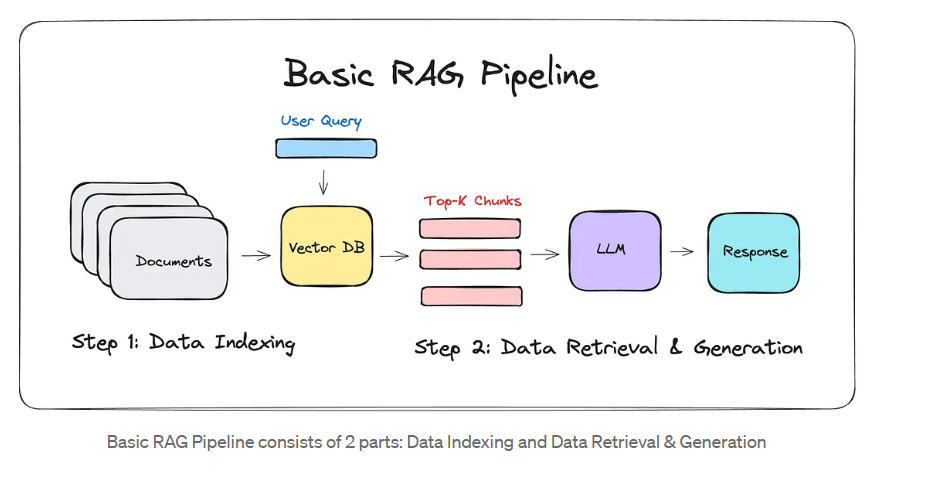
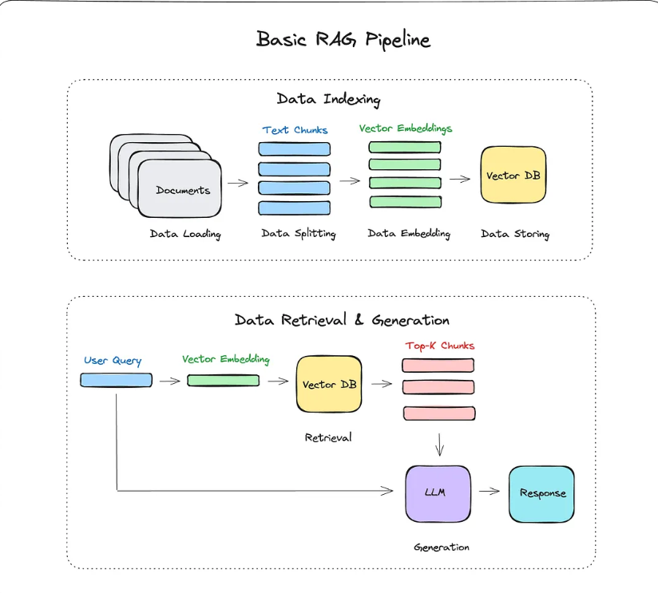

# RAGNOVA — Simple RAG Pipeline

<p align="center">
  
</p>

<p align="center">
  
  
  
  
  
  
  
  
</p>

> A production-ready, end-to-end **Retrieval-Augmented Generation (RAG)** system — **RAGNOVA** — built with LangChain, Sentence Transformers, FAISS, and Groq. Ingest multi-format documents, generate semantic embeddings, persist a searchable knowledge base, and chat with your documents through a Streamlit UI.

---

## 📚 Table of Contents

- [Overview](#-overview)
- [RAG Pipeline Flow](#-rag-pipeline-flow)
- [Features](#-features)
- [Tech Stack](#-tech-stack)
- [Project Structure](#-project-structure)
- [Getting Started](#-getting-started)
  - [Prerequisites](#prerequisites)
  - [Installation](#installation)
  - [Configuration](#configuration)
  - [Running the Application](#running-the-application)
- [How It Works](#-how-it-works)
- [Architecture](#-architecture)
- [Deploy on Streamlit Cloud](#-deploy-on-streamlit-cloud)
- [Running Tests](#-running-tests)
- [Contributing](#-contributing)
- [Security](#-security)
- [Author](#-author)
- [License](#-license)

---

## 🔍 Overview

**RAGNOVA** is a complete, document-grounded Q&A system. It ingests documents in multiple formats, splits them into semantically meaningful chunks, generates dense vector embeddings, and persists them in a local FAISS index. At query time, the most relevant chunks are retrieved and forwarded — as grounded context — to a Groq-hosted LLM, which produces accurate, cited responses.

**What this project demonstrates:**

- 📄 Multi-format document ingestion: PDF, TXT, CSV, Excel, Word, JSON
- ✂️ Intelligent recursive text splitting with configurable chunk size and overlap
- 🧠 Dense semantic embeddings via Sentence Transformers (`all-MiniLM-L6-v2`)
- 🗄️ Persistent FAISS vector index with metadata — rebuilt automatically on first run
- ⚡ Streaming and non-streaming responses via Groq LLMs (Llama 3, Mixtral, Gemma 2)
- 💬 Interactive Streamlit chat UI with short and detailed answer modes
- 🔧 Modular `src/` package — each concern is a separate, testable module

---

## 🔄 RAG Pipeline Flow

### Full Indexing & Retrieval Flow


### Simplified RAG Flow



**Indexing (Offline):**

```
Documents (PDF/TXT/CSV/…) → Load → Split into Chunks → Embed → Store in FAISS
```

**Retrieval & Generation (Online):**

```
User Query → Query Embedding → FAISS Similarity Search → Top-K Chunks → Groq LLM → Grounded Response
```

---

## ✨ Features

| # | Feature |
|---|---------|
| 1 | **Multi-format ingestion** — PDF (PyMuPDF + PyPDF fallback), TXT, CSV, Excel, Word, JSON |
| 2 | **Recursive text chunking** — configurable `chunk_size` and `chunk_overlap` |
| 3 | **Semantic embeddings** — `all-MiniLM-L6-v2` or `all-mpnet-base-v2` via Sentence Transformers |
| 4 | **FAISS vector index** — persistent L2 flat index, serialised to disk |
| 5 | **Groq LLM integration** — Llama 3.3 70B, Llama 3.1 8B, Mixtral 8x7B, Gemma 2 9B |
| 6 | **Streaming responses** — token-by-token output for snappy UX |
| 7 | **Two response modes** — *short* (400–500 words) and *detailed* (structured sections) |
| 8 | **Streamlit chat UI** — RAGNOVA app with sidebar settings and developer info |
| 9 | **Automatic index rebuild** — missing index is rebuilt from `data/` on startup |
| 10 | **Modular, tested codebase** — `src/` package with pytest suite and CI workflows |

---

## 🛠️ Tech Stack

| Component          | Technology                                          |
|--------------------|-----------------------------------------------------|
| Language           | Python 3.10+                                        |
| Orchestration      | LangChain, LangChain-Community                      |
| Document Parsing   | PyMuPDF, PyPDF, Docx2txt, UnstructuredExcel, etc.   |
| Embedding Model    | Sentence Transformers (`all-MiniLM-L6-v2`)          |
| Vector Database    | FAISS (persistent local index)                      |
| LLM Provider       | Groq (`langchain-groq`)                             |
| UI Framework       | Streamlit                                           |
| Configuration      | python-dotenv                                       |
| Testing            | pytest                                              |
| Notebooks          | Jupyter Notebook                                    |

---

## 📁 Project Structure

```text
simple-rag-pipeline/
├── .github/                        # CI/CD workflows
├── .streamlit/
│   └── config.toml                 # Streamlit theme configuration
├── assets/
│   ├── rag1.png                    # Simplified RAG flow diagram
│   └── rag2.png                    # Full RAG pipeline diagram
├── data/                           # Place source documents here
│   └── *.pdf / *.txt / *.csv / …
├── docs/
│   ├── architecture.md             # System architecture notes
│   └── deployment.md               # Deployment guide
├── faiss_store/                    # Auto-created FAISS index files
│   ├── faiss.index
│   └── metadata.pkl
├── notebook/
│   ├── doc.ipynb                   # Document loading experiments
│   └── rag_pipeline.ipynb          # End-to-end RAG indexing pipeline
├── scripts/
│   ├── rebuild_index.py            # CLI script to rebuild the FAISS index
│   └── smoke_test.py               # Quick connectivity smoke test
├── src/
│   ├── __init__.py
│   ├── data_loader.py              # Multi-format document loader
│   ├── embedding.py                # Text splitting + embedding pipeline
│   ├── vectorstore.py              # FAISS build / save / load / query
│   └── search.py                   # RAG orchestration + Groq LLM integration
├── tests/
│   ├── conftest.py
│   └── test_search_contract.py
├── app.py                          # CLI entrypoint for programmatic use
├── streamlit_app.py                # RAGNOVA Streamlit web application
├── requirements.txt
├── pyproject.toml                  # Black + Ruff configuration
├── pytest.ini
├── runtime.txt
├── .env.example                    # Environment variable template
├── Dockerfile
├── CHANGELOG.md
├── CONTRIBUTING.md
├── SECURITY.md
├── LICENSE
└── README.md
```

---

## 🚀 Getting Started

### Prerequisites

- Python **3.10** or higher
- `pip` package manager
- A free [Groq API key](https://console.groq.com/) for LLM inference
- One or more documents to index (PDF, TXT, CSV, Excel, Word, or JSON)

### Installation

**1. Clone the repository:**

```bash
git clone https://github.com/himanshu231204/simple-rag-pipeline.git
cd simple-rag-pipeline
```

**2. Create and activate a virtual environment:**

```bash
# macOS / Linux
python -m venv venv
source venv/bin/activate

# Windows
python -m venv venv
venv\Scripts\activate
```

**3. Install dependencies:**

```bash
pip install -r requirements.txt
```

**4. Add your documents:**

Place files inside the `data/` folder. Supported formats: `.pdf`, `.txt`, `.csv`, `.xlsx`, `.docx`, `.json`.

```bash
cp /path/to/your/document.pdf data/
```

### Configuration

Copy the example environment file and add your Groq API key:

```bash
cp .env.example .env
```

Edit `.env`:

```dotenv
GROQ_API_KEY="your_groq_api_key_here"
```

### Running the Application

#### Streamlit Web UI (recommended)

```bash
streamlit run streamlit_app.py
```

Open your browser at `http://localhost:8501`. On first launch, RAGNOVA will automatically build the FAISS index from the documents in `data/`. You can also trigger a manual rebuild from the sidebar.

#### CLI / Programmatic Usage

```bash
python app.py
```

#### Rebuild the Index Manually

```bash
python scripts/rebuild_index.py
```

#### Jupyter Notebook

```bash
jupyter notebook notebook/rag_pipeline.ipynb
```

---

## ⚙️ How It Works

```
┌──────────────────────┐    ┌───────────────┐    ┌──────────────────────┐
│  Documents           │───▶│ data_loader   │───▶│ embedding            │
│  data/*.pdf/txt/…    │    │ (multi-format │    │ (chunk_size=1000,    │
│                      │    │  loaders)     │    │  overlap=200)        │
└──────────────────────┘    └───────────────┘    └──────────┬───────────┘
                                                             │  embeddings
                                                             ▼
                                                   ┌──────────────────┐
                                                   │  vectorstore     │
                                                   │  (FAISS index +  │
                                                   │   metadata.pkl)  │
                                                   └────────┬─────────┘
                                                            │  top-K chunks
                              ┌─────────────┐              │
                              │  User Query │──────────────▶  search.py
                              └─────────────┘             RAGSearch
                                                             │
                                                             ▼
                                                   ┌──────────────────┐
                                                   │   Groq LLM       │
                                                   │  (streaming /    │
                                                   │   non-streaming) │
                                                   └──────────────────┘
```

1. **Ingestion** — `data_loader.py` recursively scans `data/` and loads all supported file types with appropriate LangChain loaders.
2. **Chunking** — `embedding.py` uses `RecursiveCharacterTextSplitter` to split documents into overlapping chunks.
3. **Embedding** — `SentenceTransformer` converts each chunk into a 384-dimensional dense vector.
4. **Indexing** — `vectorstore.py` adds vectors to a FAISS `IndexFlatL2` index and persists both the index and chunk metadata to `faiss_store/`.
5. **Retrieval** — At query time, the query is embedded and the nearest `top_k` chunks are fetched via L2 similarity search.
6. **Generation** — `search.py` constructs a grounded prompt and streams or returns the LLM response via `langchain-groq`.

---

## 🏗️ Architecture

Refer to [`docs/architecture.md`](docs/architecture.md) for a detailed component breakdown and data flow description.

---

## ☁️ Deploy on Streamlit Cloud

You can deploy RAGNOVA directly from GitHub to [Streamlit Community Cloud](https://share.streamlit.io/) at no cost.

### Steps

1. **Push to GitHub** — ensure the repository contains `streamlit_app.py`, `requirements.txt`, `.streamlit/config.toml`, and `runtime.txt`.
2. **Create a new app** at https://share.streamlit.io/:
   - Repository: `himanshu231204/simple-rag-pipeline`
   - Main file path: `streamlit_app.py`
3. **Add the required secret** under *App settings → Secrets*:

   ```toml
   GROQ_API_KEY = "your_groq_api_key"
   ```

4. **Click Deploy** — any subsequent push to the selected branch triggers an automatic redeploy.

### Pre-built Index (recommended for fast startup)

Build the index locally, commit `faiss_store/faiss.index` and `faiss_store/metadata.pkl`, and push. The app will start ready-to-chat without a rebuild step on Streamlit Cloud.

> **Note:** Streamlit Cloud's filesystem is ephemeral. If the index files are not committed, the app will rebuild from `data/` on startup, which may increase cold-start time.

For more details, see [`docs/deployment.md`](docs/deployment.md).

---

## 🧪 Running Tests

```bash
pytest
```

Tests are located in `tests/` and configured via `pytest.ini`. CI runs the full test suite on every push — see `.github/` for workflow definitions.

---

## 🤝 Contributing

Contributions are welcome! Please read [CONTRIBUTING.md](CONTRIBUTING.md) for guidelines on how to submit issues, feature requests, and pull requests.

---

## 🔒 Security

Please review [SECURITY.md](SECURITY.md) for the vulnerability disclosure policy. Do not open public GitHub issues for security concerns — use the contact method described in that document.

---

## 👨‍💻 Author

<p>
  <strong>Himanshu Kumar</strong>
</p>

[](https://github.com/himanshu231204)
[](https://www.linkedin.com/in/himanshu231204)
[](https://twitter.com/himanshu231204)
[](mailto:himanshu231204@gmail.com)

---

## 📄 License

This project is licensed under the [MIT License](LICENSE).
